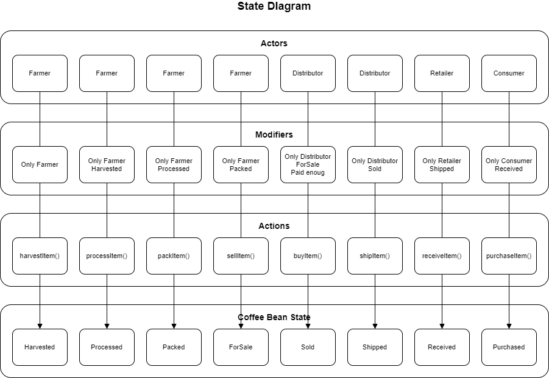

# Supply chain & data auditing

This repository containts an Ethereum DApp that demonstrates a Supply Chain flow between a Seller and Buyer. The user story is similar to any commonly used supply chain process. A Seller can add items to the inventory system stored in the blockchain. A Buyer can purchase such items from the inventory system. Additionally a Seller can mark an item as Shipped, and similarly a Buyer can mark an item as Received.

## Project write-up - UML

The DApp is based in the next diagrams:

### Activity


### Sequence


### State


### Classes


## Project write-up - Libraries

The project uses the next libraries and versions. A brief description of its use is provided:

| Library/Module/Tool | Version | Description
|---|---|---|
| *Truffle* | 4.1.14 (core: 4.1.14) | Smart contract development environment
| *Solidity* | 0.4.24 (solc-js) | Object-oriented, high-level language for implementing smart contracts
| *Infura* | | Allow the developers to connect to Ethereum networks without to store the full Ethereum blockchain.
| *Node* | 14.16.0 | JavaScript runtime that allow to develop different type de applications
| *Web3.js* | 1.3.5 | Collection of libraries that allow you to interact with a local or remote ethereum node using HTTP, IPC or WebSocket.
| *truffle-hdwallet-provider* | 1.0.17 | HD Wallet-enabled Web3 provider. Use it to sign transactions for addresses derived from a 12 or 24 word mnemonic.
| *MetaMask* | 9.6.1 | Crypto wallet & gateway to blockchain apps. Browser based.
| *dotenv* | ^10.0.0 | Module that loads environment variables from a .env file into process.env
| *Ownable* |  | Contract module which provides a basic access control mechanism, where there is an account (an owner) that can be granted exclusive access to specific functions.
| *Roles* |  | Library for implementing role-based access control.

## Transactions and Contracts

The project was deployed in the Rinkeby Network with the next transactions and contract addresses:

| Contract | Transaction | Address |
|---|---|---|
|  *Migrations* | [0x1bbeda471b0d9e6fef4337cf974dfe0ae43dd22a2b07fa1977d5244dcbc6db6a](https://rinkeby.etherscan.io/tx/0x1bbeda471b0d9e6fef4337cf974dfe0ae43dd22a2b07fa1977d5244dcbc6db6a) | [0x9d6c89dbc0143a52dc2b35331fd8443bd4c4e0ff](https://rinkeby.etherscan.io/address/0x9d6c89dbc0143a52dc2b35331fd8443bd4c4e0ff) |
|  *FarmerRole* | [0xa414a8987de8bdf0a6a9e11d2ee9475e5d41889e30fb284066da0655307f4b16](https://rinkeby.etherscan.io/tx/0xa414a8987de8bdf0a6a9e11d2ee9475e5d41889e30fb284066da0655307f4b16) | [0xa9d8897ac0c52b8b9e509de89041fc22735e4ad7](https://rinkeby.etherscan.io/address/0xa9d8897ac0c52b8b9e509de89041fc22735e4ad7) |
|  *DistributorRole* | [0xd069e88a156e1bcc0f43f8b6d399cfcc9639febe044bd9ef75b8c2047037087b](https://rinkeby.etherscan.io/tx/0xd069e88a156e1bcc0f43f8b6d399cfcc9639febe044bd9ef75b8c2047037087b) | [0x2568e52e05b6e83840859d85f42de6169a622d44](https://rinkeby.etherscan.io/address/0x2568e52e05b6e83840859d85f42de6169a622d44) |
|  *RetailerRole* | [0xf2429c15b5fb66c6475ae7f0d82b2ceac0dd2414dec4b8bf249b4d1862e0b224](https://rinkeby.etherscan.io/tx/0xf2429c15b5fb66c6475ae7f0d82b2ceac0dd2414dec4b8bf249b4d1862e0b224) | [0x1bb94c52b2246a989c3be9b4ab7fd142c08cbb70](https://rinkeby.etherscan.io/address/0x1bb94c52b2246a989c3be9b4ab7fd142c08cbb70) |
|  *ConsumerRole* | [0xb15200f1734376015cf831aa8b8ba94eb7ff4d8bdc3c6b3f7c882f71d80f10f3](https://rinkeby.etherscan.io/tx/0xb15200f1734376015cf831aa8b8ba94eb7ff4d8bdc3c6b3f7c882f71d80f10f3) | [0xa970db0606bf426a3b1c19738729e022b911cfce](https://rinkeby.etherscan.io/address/0xa970db0606bf426a3b1c19738729e022b911cfce) |
|  *SupplyChain* | [0xc7718a6d17b248aabfe2afa146d271ef4fcc4c91fdc3647b5b8302b815a1960a](https://rinkeby.etherscan.io/tx/0xc7718a6d17b248aabfe2afa146d271ef4fcc4c91fdc3647b5b8302b815a1960a) | [0x036d68c15e44e37d3bd7b13e674e85f8ea0083c6](https://rinkeby.etherscan.io/address/0x036d68c15e44e37d3bd7b13e674e85f8ea0083c6) |

## Run the application

1. **Node and NPM** installed - NPM is distributed with [Node.js](https://www.npmjs.com/get-npm)
```bash
# Check Node version
node -v
# Check NPM version
npm -v
```

2. **Truffle v4.1.14** - A development framework for Ethereum. 
```bash
# Unsinstall any previous version
npm uninstall -g truffle
# Install this specific Truffle version
npm install -g truffle@4.1.14
# Verify the version
truffle version
```

3. **Dependencies**
```bash
# Project's root directory
npm install
```

4. **MetaMask** - Install MetaMask extension in your browser.

5. **Ganache** - Install Ganache. This tool must be running to be able to test the DApp. Depending if you are using the desktop app or the command line version, the network url is different and we must configure it in Metamask and this DApp also. In my case i am using the desktop version:


6. **Add a Custom RPC** in MetaMask with these information depending of Ganache version:

| Ganache Version | Network Name | New RPC URL | Chain ID |
|---|---|---|---|
| UI |Private Network 1|`http://127.0.0.1:7545/`|1337 |
| ganache-cli |Private Network 1|`http://127.0.0.1:8545/`|1337 |

7. **Add an account to Metamask** Choose one of the accounts that Ganache is showing and add it to Metamask with its private key. MetaMask must show the balance of the account.

8. **Compile the contracts**. Run in the terminal:
```bash
# Project's root directory.
truffle compile
```


9. **Migrate the contracts**. Run in the terminal:
```bash
# Project's root directory.
truffle migrate
```


10. **(Optional) Test the contracts**. Run in the terminal:
```bash
# Project's root directory.
truffle test
```


11. **Update Web3 Http provider**. Go to src/app.js:
```js script
// Go to line 77:
App.web3Provider = new Web3.providers.HttpProvider('<URL>');
// Replace it with the correct URL depending of Ganache version you are using.
// Desktop version
App.web3Provider = new Web3.providers.HttpProvider('http://localhost:7545');
// Or Command line version
App.web3Provider = new Web3.providers.HttpProvider('http://localhost:8545');
```

12. **Run the app**. Run in the terminal:
```bash
# Project's root directory.
npm run dev
```

## DApp showcase

Once you running the last command, you can open your browser in http://localhost:3000/ showing the application:


The first time you open the app, Metamask must shows a popup requesting connect an account with the DApp. You must select the account you added steps before.

To test the app you must be pressing the buttons in the right order: Harvest, Process, Pack, ForSale, Buy, Ship, Receive and Purchase. Each time you press a button, Metamask must show a popup to confirm the transaction you want to send to the blockchain. After the confirmation, a new record is added in the Transaction History section.

## Deploying to Rinkeby

In case you want to deploy the contracts to Rinkeby network you must create a .env file in project's root with the next environment variables:
```bash
INFURA_KEY=<YOUR INFURA KEY>
SECRET=<YOUR METAMASK 12 WORD SEED>
```

Then you must run the next commands in terminal:
```bash
truffle compile
truffle migrate --network rinkeby --reset
```


